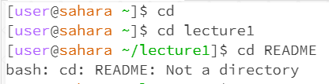
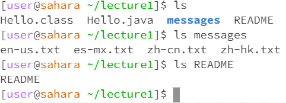
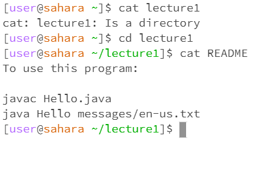

**Lab Report 1**

When I typed "cd" into the terminal with no arguments, nothing happened and there was no input. This is because we did not decalre which directory to change into. This is not a error on the terminal but rather a human error as I did not select a directory to change into. If we were to be already in, for example, the lecture1 directory, the command would change it back to the larger encompassing directory of lecture1.
When I typed cd lecture1, there was no output but on the contrary the new terminal line directory indicated that I had changed into the Lecture1 folder (this is not an error). 
Lastly, when I tried to cd into README file, we came across an error that essentially indicated that the README file was not a directory. This is because the README file is not a folder and is a` file, therefore there are no embedded files within that we can access.

When I simply input the ls command in the terminal without any arguments, the terminal outputs a list of all the files and directories that are included within the existing directory.
However, when we ls into the embedded messages directory, we get a list of all the Hello txt files that we were given and created.
Lastly, when we try to ls into a file, in this case the README file, we simply get the file name that we listed as the output.
Overall, there are no errors when using ls as long as a directory or file exists within the argument .

When I first used cat alone, we were simply given a user prompt to type in an input which would then have the terminal output what we inputted.
Next, when trying to cat lecture1 we ran into an error that essentially stated that lecture1 is a directory. This makes sense because directories host other files which contain content within them, it wouldn't make sense to print the output of a directory which would just be the list of files.
Lastly, when I used cat on README the terminal outputted and printed the contents of the README file. This is probably the most conventional way of using cat as it allows for the user to quickly access the written contents of certain files.
