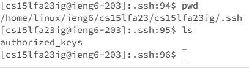
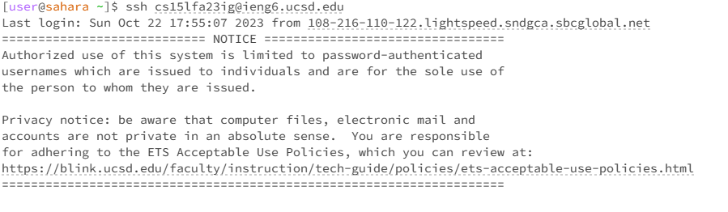
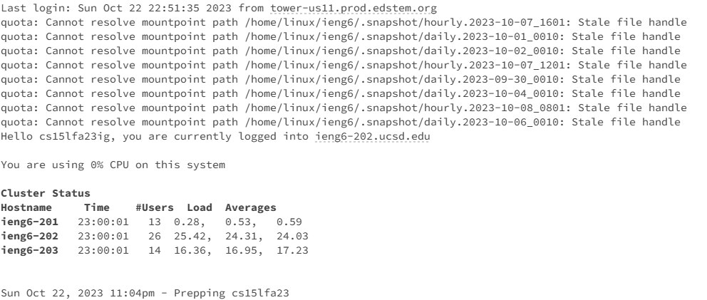

**Lab Report 2**

**Part 1**
```
import java.io.IOException;
import java.net.URI;

class Handler implements URLHandler {
    private StringBuilder messageList = new StringBuilder(); //Decided to not use a List and switch to a StringBuilder object

    private int count = 0;
    public String handleRequest(URI url) {
        if (url.getPath().equals("/add-messages")) { 
            String query = url.getQuery();
            if (query != null && query.startsWith("s=")) {
                String message = query.substring(2);
                count++;
                messageList.append(count).append(". ").append(message).append("\n");
                return messageList.toString();
            }
        }
    return "404 Not Found!";
    }
}

class StringServer {
    public static void main(String[] args) throws IOException {
        if(args.length == 0){
            System.out.println("Missing port number! Try any number between 1024 to 49151");
            return;
        }

        int port = Integer.parseInt(args[0]);

        Server.start(port, new Handler());
    }
}
```

The methods that are called within my code are the handleRequests method and the newLine method within the Handler class. the argument for the handleRequest would be the user-inputted url, in this case https://0-0-0-0-4000-lp2fvifffngpik1ghadvi73v7k.us.edusercontent.com/add-message?s=Hello, and the newLine method took in the list that we constructed within the Handler class. The changes include that one of the new Strings from the list were ouputted onto the page, in this case going from nothing to having 1. Hello, as well as the index of the count incrementing from 0 to 1. 


Similar to the previous screenshot, the methods that are called within my code are the same as the previous: the handleRequests method and the newLine method within the Handler class. the argument for the handleRequest would be the user-inputted url, in this case https://0-0-0-0-4000-lp2fvifffngpik1ghadvi73v7k.us.edusercontent.com/add-message?s=How%20Are%20You, and the newLine method took in the list that we constructed within the Handler class. The changes include that one of the new Strings from the list were ouputted onto the page, in this case going from 1. Hello to 1.Hello and 2. How Are You, as well as the index of the count incrementing from 1 to 2. 

**Part 2**

Screenshot of ls to the paths to the private and public keys:
<br>



Screenshot of Logging in without the use of a password:
<br>



**Part 3**
Something that I learned from Labs 2 and 3 was how to run Java files on a local computer, as well as a remote computer through the use of public and private SSH keys, on a local server that can be accessed by others connected to the same internet. Although this took a lot of experimentation to fully understand the process, I eventually was able to swiftly understand that the javac command is used to compile the following java files and that java StringServer 4000 (or any other 4-digit length number) will run the server on a local host. 
